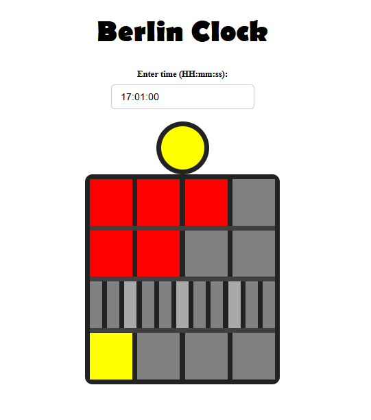

# Berlin Clock Kata

The Berlin Clock (Mengenlehreclock or Berlin Uhr) is a clock that tells the time using a series of illuminated coloured blocks, as you can see in the picture for this project.

The top lamp blinks to show seconds- it is illuminated on even seconds and off on odd seconds.

The next two rows represent hours. The upper row represents 5 hour blocks and is made up of 4 red lamps. The lower row represents 1 hour blocks and is also made up of 4 red lamps.

The final two rows represent the minutes. The upper row represents 5 minute blocks, and is made up of 11 lamps- every third lamp is red, the rest are yellow. The bottom row represents 1 minute blocks, and is made up of 4 yellow lamps.

You can read more about the Berlin Clock on Wikipedia https://en.wikipedia.org/wiki/Mengenlehreuhr.

Source: https://agilekatas.co.uk/katas/BerlinClock-Kata



---

This project was generated using [Angular CLI](https://github.com/angular/angular-cli) version 19.2.11.

## Development server

To start a local development server, run:

```bash
ng serve
```

Once the server is running, open your browser and navigate to `http://localhost:4200/`. The application will automatically reload whenever you modify any of the source files.

## Code scaffolding

Angular CLI includes powerful code scaffolding tools. To generate a new component, run:

```bash
ng generate component component-name
```

For a complete list of available schematics (such as `components`, `directives`, or `pipes`), run:

```bash
ng generate --help
```

## Building

To build the project run:

```bash
ng build
```

This will compile your project and store the build artifacts in the `dist/` directory. By default, the production build optimizes your application for performance and speed.

## Running unit tests

To execute unit tests with the [Karma](https://karma-runner.github.io) test runner, use the following command:

```bash
ng test
```

## Running end-to-end tests

For end-to-end (e2e) testing, run:

```bash
ng e2e
```

Angular CLI does not come with an end-to-end testing framework by default. You can choose one that suits your needs.

## Additional Resources

For more information on using the Angular CLI, including detailed command references, visit the [Angular CLI Overview and Command Reference](https://angular.dev/tools/cli) page.
